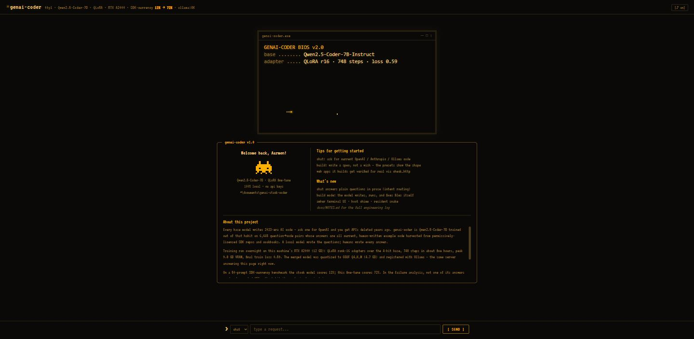
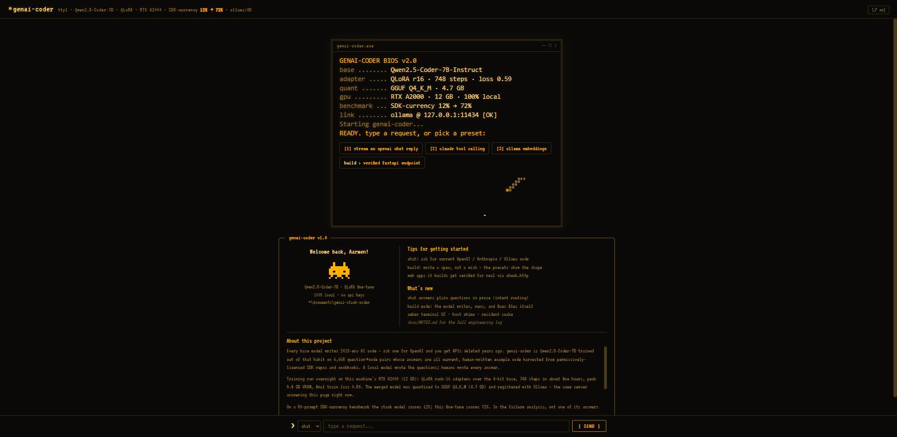

# GenAI-Stack-Coder

Fine-tuning **Qwen2.5-Coder-7B-Instruct** on a single RTX A2000 12GB (native Windows, no admin rights) to do one thing better than models 100× its size: **write correct, current generative-AI application code** — modern OpenAI / Anthropic / Ollama SDK usage, streaming, tool calling, structured output.

**Why:** every base model hallucinates 2023-era SDK calls (`openai.ChatCompletion.create`, anyone?). This model is QLoRA-trained exclusively on current, human-written, permissively-licensed example code so it doesn't. **Result: 12% → 72%** on a 50-prompt SDK-currency benchmark — and every stage, from data harvest to the benchmark itself, reruns from scripts in this repo.

**Finale:** driven by the ~400-line agent harness in this repo, the tuned model wrote the first version of its own chat app — and in the app's Build mode you can still watch the model write, run, and fix real files live.


*The demo app: an amber-phosphor terminal that boots your model's real spec sheet. Yes, there is a resident snake.*

## Results

50-prompt SDK-currency benchmark; both models served by Ollama at Q4_K_M, temperature 0.2, identical system prompt (`eval/run_eval.py`; scoring rules in `eval/assertions.py`).

| SDK | base qwen2.5-coder:7b | genai-coder (tuned) |
|---|---|---|
| openai | 1/20 (5%) | **14/20 (70%)** |
| anthropic | 1/20 (5%) | **15/20 (75%)** |
| ollama | 4/10 (40%) | **7/10 (70%)** |
| **total** | **6/50 (12%)** | **36/50 (72%)** |

A re-run four days later scored 35/50 (stable), with **zero deprecated-API calls in any of the 50 answers**; a manual audit found the automated grader slightly strict — honest score ~76% (`docs/NOTES.md`, 2026-07-21).

Canonical "before" example — the base model answers a streaming question with `openai.ChatCompletion.create(stream=True)`, removed from the SDK in Nov 2023; the tuned model instantiates the current `OpenAI()` client and streams with the `client.chat.completions.stream(...)` helper.

## What's in the box

- **The trained adapter** — `models/adapter/final/` (155 MB, via **git-lfs**): the one irreplaceable training output. Everything bigger (15 GB merged weights, 4.7 GB GGUF) rebuilds from it plus public downloads.
- **The full pipeline** — data harvest → instruct pairs → filter/dedupe → QLoRA train → benchmark → GGUF/Ollama packaging. Every stage is a script you can rerun.
- **A benchmark** — 50 prompts + automated SDK-currency scoring, with stored results for every run.
- **An agent harness** — a ~400-line coding agent (`agent/agent.py`, 22 protocol tests) that lets the model write files, run commands, and verify web servers with real HTTP requests.
- **The demo app** — a retro terminal chat/build UI (screenshot above) served by FastAPI.
- **The diary** — `docs/NOTES.md` logs every decision, failure, and fix, from the CUDA-wheel trap to the six attempts it took the model to build its own app.

## Quickstart A — run it with the trained weights (~30–60 min, mostly downloads)

Prereqs: **Python 3.12**, **[Ollama](https://ollama.com)** installed and running, **git-lfs** (`git lfs install` once), a **llama.cpp checkout** (see note below), ~40 GB free disk, 16 GB+ RAM (the merge step itself needs ~16 GB free), and — for the one-time merge step — an **NVIDIA GPU with CUDA** (the pinned training requirements are Windows-specific; after packaging, *running* via Ollama needs no GPU and works anywhere Ollama does). Commands are Windows-style with forward slashes (they work in cmd, PowerShell, and Git Bash); on Linux/macOS substitute `.venv/bin/`.

```bash
git clone https://github.com/aarmens702-hub/genai-stack-coder.git
cd genai-stack-coder
git lfs pull                                  # fetches the 155 MB adapter

python -m venv .venv
.venv/Scripts/pip install -r requirements.txt # runtime deps (openai, requests, fastapi, uvicorn)
# training/merge deps: do NOT plain-install requirements-train.txt -- torch's
# cu128 wheels are not on PyPI. Follow the 4 ordered install commands in the
# header of requirements-train.txt (exact index URLs and --no-deps flags).

ollama pull qwen2.5-coder:7b                  # base model; also the chat-template donor for make_ollama.py

# rebuild the model from the adapter (downloads the ~5.5 GB 4-bit base from HF
# once; writes ~15 GB merged fp16 to models/merged/)
.venv/Scripts/python packaging/merge_lora.py
.venv/Scripts/python packaging/make_ollama.py # f16 GGUF -> Ollama Q4_K_M (needs llama.cpp, see below)

ollama run genai-coder "write python that streams a chat reply from the openai api"

# the demo app
.venv/Scripts/python demo/main.py             # open http://127.0.0.1:8000
```

**llama.cpp note:** `make_ollama.py` uses llama.cpp's `convert_hf_to_gguf.py` and expects the checkout **inside the repo root**: from inside `genai-stack-coder/`, run `git clone https://github.com/ggml-org/llama.cpp llama.cpp-src` (conversion is pure Python — no C++ build needed; quantization happens inside the Ollama server). If the packaging CLI dies mid-create on a locked-down machine, `packaging/create_via_api.py` is the kill-resilient path (see NOTES 2026-07-16).

## Quickstart B — reproduce the whole thing from zero

The full run: harvest → dataset → train → package → benchmark. Budget an evening plus one overnight. **Start from Quickstart A's clone + venv + both dependency installs**, then:

```bash
# 0. environment sanity: the pinned training set (torch 2.10.0+cu128,
#    xformers 0.0.34 --no-deps, triton-windows 3.6.0.post26, unsloth) must be
#    installed per the 4 ordered commands in requirements-train.txt's header.
#    Windows + CUDA is a minefield -- see NOTES 2026-07-14 before improvising.

# 1. data pipeline (~4 h, mostly local question generation via Ollama)
ollama pull qwen2.5-coder:7b                  # the question-writing teacher
.venv/Scripts/python scripts/01_harvest.py    # clone sources, extract snippets
.venv/Scripts/python scripts/02_build_pairs.py
.venv/Scripts/python scripts/03_filter_dedupe.py
.venv/Scripts/python scripts/04_split.py      # -> 5,973 train / 348 val / 344 test

# 2. training (sanity gate ~20 min, full run ~5 h on a 12 GB GPU)
.venv/Scripts/python train/train_unsloth.py --sanity   # must reach loss ~0.1
.venv/Scripts/python train/train_unsloth.py            # 748 steps; auto-resumes if killed

# 3. package + benchmark
.venv/Scripts/python packaging/merge_lora.py
.venv/Scripts/python packaging/make_ollama.py
.venv/Scripts/python eval/run_eval.py --model qwen2.5-coder:7b   # base row
.venv/Scripts/python eval/run_eval.py --model genai-coder        # your row
```

Notes for faithful reproduction: harvest "pins" resolve to the latest release tag / HEAD at clone time, so a fresh harvest floats forward — the exact refs used for the shipped adapter are recorded in `docs/LICENSES.md` and `data/sources.yaml`. Free the GPU before training: `ollama stop qwen2.5-coder:7b` unloads the model, but on Windows the tray app can reload it — quitting the Ollama app entirely is the reliable route. Expect ~24 s/step.

## The demo app



A single-file retro terminal (`demo/index.html` + `demo/main.py`) with two modes:

- **Chat** — intent-routed: code questions run under the benchmarked system prompt and stream back as code blocks with copy buttons; conversational messages get plain English. Enter sends; `[ SEND ]` becomes `[ STOP ]` mid-generation.
- **Build** — the model writes files into `workspace/<run>/`, runs them, reads errors, fixes them, and verifies web servers with real HTTP requests (`check_http`). Use the template dropdown: precise specs get working software, one-line wishes get stubs. Every Build task auto-receives discipline rules (no interactive `input()` programs, verify before done, use port 8123 — some ports are firewalled on locked-down machines: check `netsh interface ipv4 show excludedportrange protocol=tcp`).

Attribution, honestly: the **first version of this app was written by genai-coder itself** through the agent harness (see NOTES 2026-07-20 for the six-attempt saga, preserved in `agent/logs/`); the v2 upgrade was ~95% model-written with a disclosed 15-line human patch; the current retro UI (boot sequence, welcome window, snake) is human-designed. The model remains the builder behind Build mode.

The agent harness also works standalone:

```bash
.venv\Scripts\python agent\agent.py --task "Create rev.py: python rev.py WORD prints WORD reversed; wrong usage prints a usage line and exits 1. Verify both, then use done." --workdir workspace\rev
```

## Layout

| Path | What |
|---|---|
| `scripts/` | data pipeline: harvest → pairs → filter → split |
| `train/` | QLoRA training script (Unsloth; config as constants in-file) |
| `models/adapter/final/` | **the trained LoRA adapter** (git-lfs) |
| `eval/` | 50-prompt SDK-currency benchmark + scoring + stored results |
| `packaging/` | LoRA merge → GGUF convert → Ollama create |
| `agent/` | coding-agent harness + protocol tests + run logs |
| `demo/` | the terminal chat/build app |
| `docs/` | `NOTES.md` (engineering log), `MODEL_CARD.md`, `LICENSES.md` |

## Hardware & constraints this was built under

RTX A2000 12 GB · 32 GB RAM · Windows 11 · **no admin rights** (per-user installs only, WSL2 unavailable) · Python 3.12. Peak training VRAM 9.79 GB. If it ran here, it runs on any 12 GB+ NVIDIA card — and the constraint-specific landmines (CPU-only torch wheels from PyPI, EDR killing bulk-reading child processes, Windows excluded port ranges) are all documented in `docs/NOTES.md` with their workarounds.

## License

Code: MIT (see `LICENSE`). Adapter weights: Apache-2.0 (matching the Qwen2.5 base). Training-data sources and their licenses: `docs/LICENSES.md`. Model details: `docs/MODEL_CARD.md`.
